# 桶

桶是 Bolt 中键值数据的容器，开发者可以在同一个 Bolt 实例中创建不同的桶，存放不同门类的数据。桶还支持无限嵌套，即桶里可以创建子桶，为开发者归类数据提供更灵活的方案。

## 目录

* 桶的逻辑结构
* 桶的物理结构
* 游标

## 桶的逻辑结构

Bolt 里的每个桶既可以存放子桶也可以存放键值数据，得益于这个设计，Bolt 实例在初始化时创建一个根桶 (root bucket) 即可。用户创建的所有桶和键值对都会被保存在根桶中，嵌套地构成一棵树。

当开发者[创建新桶](./bucket/create_bucket.go)时：

```go
// bucket/create_bucket.go
func main() {
  db, _ := bolt.Open("1.db", 0600, nil)
  defer db.Close()
  
  _ = db.Update(func(tx *bolt.Tx) error {
    _, err := tx.CreateBucketIfNotExists("bucket1")
  })
}
```

Bolt 就在根桶上插入一个新的键值对，键为 "bucket1"，值为这个 bucket 实例，如下图所示：

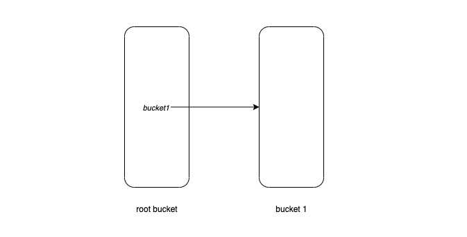

继续创建 bucket2, bucket3，可以得到：

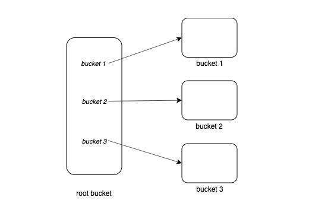

往 bucket2 中插入键值数据 `{k1: v1}` 和 `{k2: v2}`，可以得到：

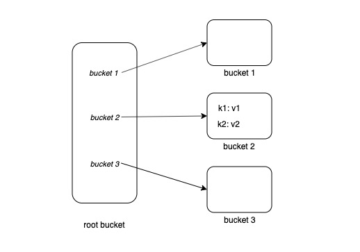

在 bucket2 中继续创建两个子桶 bucket23 和 bucket24，可以得到：

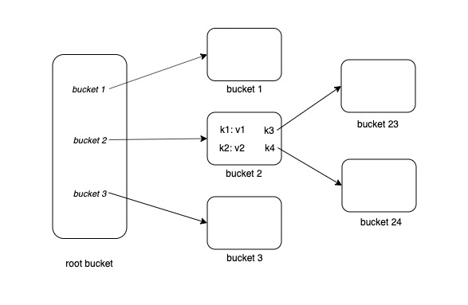

在上图中，我们已经看到了一棵树的样子。

## 桶的物理结构

在[B+ 树](DATA_AND_INDEX.md)一节中介绍到 Bolt 使用 B+ 树存储索引及原数据，那么它是如何利用 B+ 树实现桶呢？我们从最简单的情形开始理解：

### 初始化 DB

在初始化新的实例时 Bolt 会创建根桶，在 DB 的[初始化方法](https://github.com/boltdb/bolt/blob/master/db.go#L343) 中可以看到：

```go
func (db *DB) init() error {
  buf := make([]byte, db.pageSize*4)
  for i := 0; i < 2; i++ {
		// ...
		// Initialize the meta page.
		m := p.meta()
		// ...
		m.root = bucket{root: 3}
		// ...
  }
  // ...
  // Write an empty leaf page at page 4
  p = db.pageInBuffer(buf[:], pgid(3))
  p.id = pgid(3)
  p.flags = leafPageFlag
  p.count = 0
  // ...
}
```

根桶的信息被储存在 meta page 中。初始化完毕后，根桶指向了一个空的 leaf page，后者将成为所有用户创建的子桶及键值数据的容器，如下图所示：


### 创建一个桶

假设用户初始化 Bolt 实例后，创建一个名字叫 "b1" 的桶，反映在图中就是

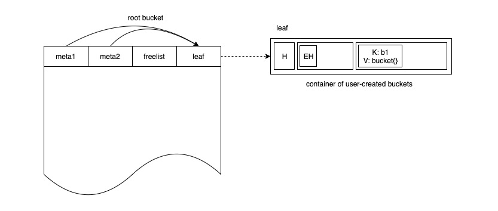

在 leaf page 中增加一个键值对，其中键为 `b1`，值为 `bucket` 实例。`bucket` 实例的结构体定义如下：

```go
type bucket struct {
	root		pgid   // page id of the bucket's root-level page
	sequence	uint64 // monotonically incrementing, used by NextSequence()
}
```

这里的 `root` 指向该桶根节点的 page id。但如果我们为每个新桶都分配一个单独的 page，在需要大量使用小桶的场景下，会产生内部碎片，浪费存储空间。借用 [nested-bucket](https://github.com/boltdb/bolt#nested-buckets) 的例子：假设我们使用 Bolt 做为一个多租户服务的数据库，这个服务需要一个 tanents 桶存放每个租户的数据，每个租户内部包含有 Users, Notes 等其它子桶。假设实际使用情况符合幂律，80% 的租户数据只占总数据量的 20%，这时候如果为这些小租户的子桶都分配新的 page，就可能造成磁盘空间浪费。

Bolt 使用 inline-bucket 来解决上述问题。inline-bucket 不会占用单独的 page，一个虚拟的 page，逻辑上它就是一个 page。每个 inline-page 中同样存有 page header，element headers 和 data，存储时它将被序列化成一般的二进制数据与桶名一起作为普通键值数据储存。实际上，所有新建的桶，包括我们刚刚创建的 b1，都是 inline-bucket。Bolt 利用 pgid 从 1 开始的特点，用 `pgid = 0` 表示 inline-bucket，因此上图可以细化为：

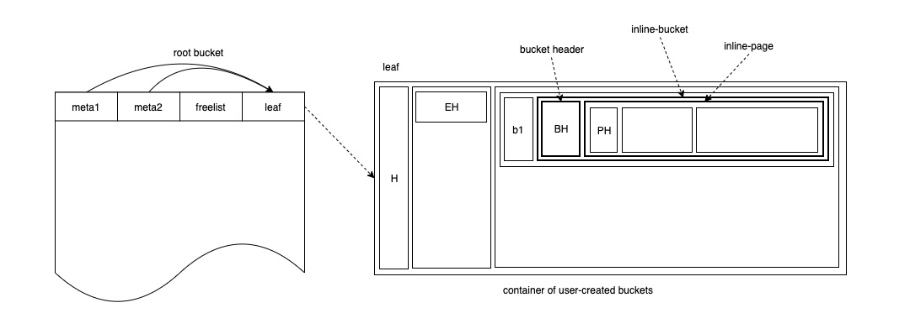

向 b1 桶中插入键值对 `{k1:v1}`，可以表示为：

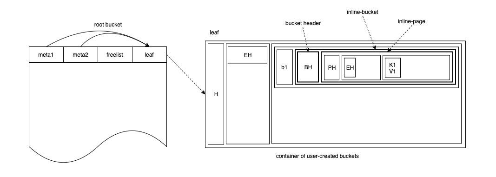

### 插入更多的键值数据

当 b1 桶中的数据达到一定量，即超过 inline-bucket 的大小限制时，inline-bucket 就会被转化成正常的的桶，并能够分配到属于自己的 page，如下图所示：

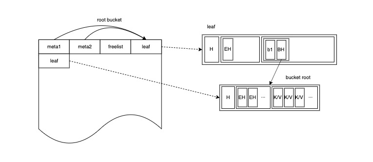

插入更多的键值数据，b1 桶就会长成一棵更茂盛的 B+ 树：

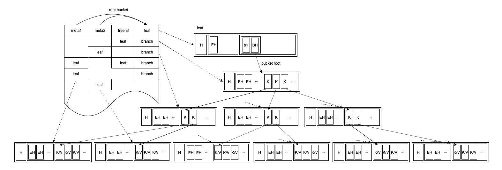

### 创建更多的桶

假设用户继续创建更多像 b1 一样的桶，直到一个 leaf 节点无法容纳根桶的所有子节点，这时 root bucket 自身也将长成一棵更茂盛的 B+ 树：

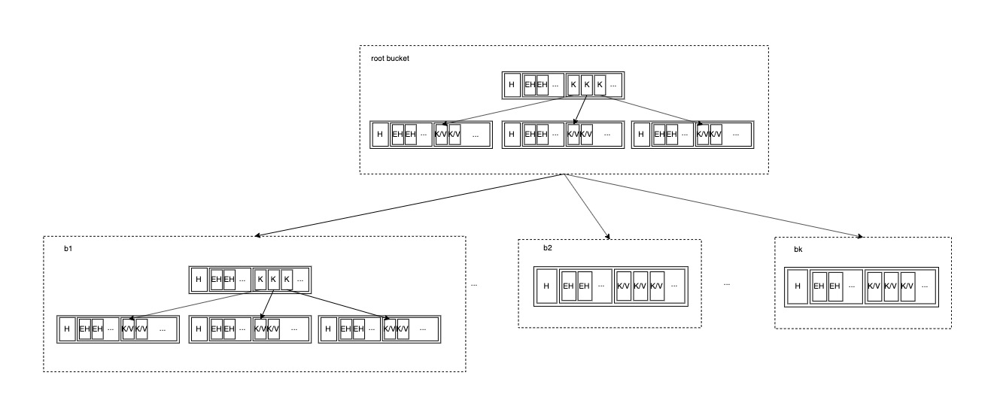

需要注意的是，尽管每个桶内部的数据是合法的 B+ 树，但它们共同组成的树通常不是 B+ 树。

## 游标

游标是帮助用户顺序或着随机访问桶中键值数据的数据结构，它对外提供的方法包括：

```go
// 移动 cursor 到 bucket 中的第一个键值对，并返回键值数据
func (c *Cursor) First() (key []byte, value []byte)
// 移动 cursor 到 bucket 中的最后一个键值对，并返回键值数据
func (c *Cursor) Last() (key []byte, value []byte)
// 移动 cursor 到下一个键值对，并返回键值数据
func (c *Cursor) Next() (key []byte, value []byte)
// 移动 cursor 到上一个键值对，并返回键值数据
func (c *Cursor) Prev() (key []byte, value []byte)
// 移动 cursor 到给定键所在位置，并返回键值数据
func (c *Cursor) Seek(seek []byte) (key []byte, value []byte)
// 删除 cursor 所在位置的键值数据
func (c *Cursor) Delete() error
```

它们可以被分为两类：

* 顺序访问/遍历：First、Last、Next、Prev
* 随机访问/检索：Seek

### 顺序访问/遍历

我们已经知道 Bolt 实例中每个叶子桶的逻辑结构都是 B+ 树，因此遍历叶子桶内数据的过程，就是遍历 B+ 树的过程。在树形数据结构上遍历的算法从实现上可以分为递归和迭代两种，前者具有更强的可读性，后者在运行时更节约栈空间。由于数据库中的 B+ 树单个节点较大，整棵树呈矮胖状，在递归时不会占用过多的栈空间，这里栈空间的占用就可以不予考虑。在使用游标的过程中，通常不会一次性遍历完所有数据，而是读到哪，走到哪，因此游标需要在每次移动后记录当前的位置信息。以下是游标的数据结构：

```go
type Cursor struct {
  bucket *Bucket
  stack  []elemRef
}
```

将栈放进结构体中，方便游标记录上一次所在的位置信息。B+ 树的中间节点不直接存储键值数据，因此遍历过程没有前序、中序、后序的区别。通内可能嵌套其它子桶，当游标在返回数据时，如果遇到值是子桶的情况，就会将其置为 nil，从而区分两种情况。我们可以通过以下[例子](./bucket/visitkv.go)看到这点：

```go
// bucket/visitkv.go
func main() {
	// init db
	// ignore errors for simplicity
	_ = db.Update(func(tx *bolt.Tx) error {
		b1, _ := tx.CreateBucketIfNotExists([]byte("b1"))
		_, _ = b1.CreateBucketIfNotExists([]byte("b11"))
		_ = b1.Put([]byte("k1"), []byte("v1"))
		_ = b1.Put([]byte("k2"), []byte("v2"))

		return b1.ForEach(func(k, v []byte) error {
      fmt.Printf("key: %s, val: %s, nil: %v\n", k, v, v == nil)
			return nil
		})
	})
}
```

执行程序：

```sh
$ go run visitkv.go
key: b11, val: , nil: true
key: k1, val: v1, nil: false
key: k2, val: v2, nil: false
```

可以看到，当访问到 b11 桶时，返回的值是 nil。

### 随机访问/检索

由于 B+ 树上所有数据都按照键的字节序排列，因此检索的过程与二叉查找树相似。与二叉查找树不同，B+ 树上单个节点通常较大，存放数据较多，因此在单个节点上检索时会使用二分查找来提高检索效率。我们可以尝试估算检索过程的算法复杂度，如下图所示：

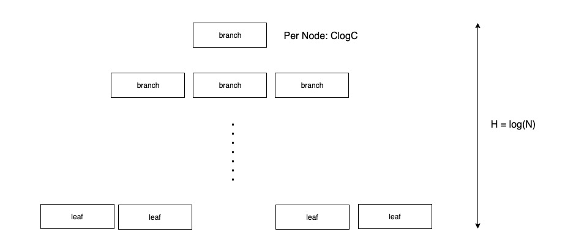

设数据的总数为 `N`，单个节点能够容纳的键值对数量上限为 `C`，那么单个节点的查找复杂度为 `Clog(C)`，树的高度为 `log(N)`，整个检索过程的时间复杂度为 `Clog(C)log(N)`。CMU 15-445 的 Tree Index 一节提供的数据显示：一棵 3 层的 B+ 树可以容纳 2,406,104 条数据，一棵 4 层的 B+ 树可以容纳 312,900,721 条数据，尽管这里的绝对数值没有参考意义 (与 page 大小和单个键值数据平均大小有关)，我们可以认为树的高度为常数，因此整个检索的算法复杂度可以近似为 `O(1)`。

值得一提的是，在实现中，游标在 seek 时采用递归算法，且都是尾递归，具体可查阅源码。

## 小结

本节介绍桶的逻辑结构、物理结构以及如何访问桶中的数据：

* 逻辑上，每个 Bolt 实例保持一个根桶，内部盛放所有用户创建的子桶和键值数据，用户可以在这些子桶中插入普通键值数据或者按需继续嵌套地创建子桶。整个实例中存储的数据可以被看作是一棵大树；
* 物理上，每个桶是一棵 B+ 树，这些树根据嵌套关系共同组成一棵巨大的树，这棵大树一般不是 B+ 树；
* 游标支持顺序和随机两种访问键值数据的方式。