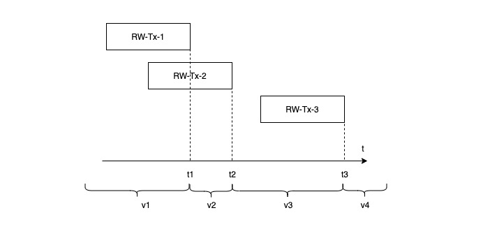
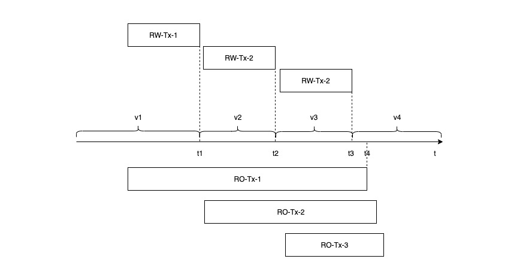
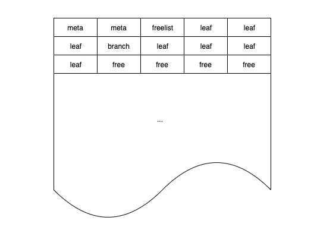

# 事务

事务是数据库提供给应用的一层抽象，这层抽象将所有的并发问题和软硬件的各种可能的错误隐藏，只对应用暴露出两种状态：成功（commit）和终止（abort），所有事务中发生的修改要么执行、要么回滚，不存在执行到一半的中间状态。有了事务支持，应用的错误处理逻辑变得十分简单：重试即可。

boltDB 为用户提供**可序列化（serializable）** 的、满足 **ACID** 性质的事务支持。

## 目录

* 多个只读事务与最多一个读写事务
* 事务执行过程与 ACID
* MVCC

## 多个只读事务与最多一个读写事务

boltDB 允许多个只读事务与最多一个读写事务同时运行，这条限制极大地简化了 boltDB 的并发控制逻辑。要做到这一点，需要一个读写锁。由于 boltDB 可能在多个进程中访问相同的实例，这个🔐不能只存在于内存中；又考虑到 boltDB 是单机数据库，这个🔐不需要是分布式的，因此 boltDB 需要一个单机级别上的能跨进程访问的🔐：**flock**，利用 file descriptor 的唯一性来实现🔐。

每次打开 boltDB 连接，会立即执行 flock：

```go
func flock(db *DB, mode os.FileMode, exclusive bool, timeout time.Duration) error {
	// ...
  flag := syscall.LOCK_SH   // 只读模式获取共享锁
  if exclusive {
    flag = syscall.LOCK_EX  // 读写模式获取互斥锁
  }

  err := syscall.Flock(int(db.file.Fd()), flag|syscall.LOCK_NB)
  // ...
}
```

若用户选择指定只读模式打开 boltDB 实例，即：

```go
db, err := bolt.Open("1.db", 0600, &bolt.Options{ReadOnly: true})
```

那么 flock 会获取 "1.db" 文件的共享锁，若用户未选择或以非只读模式打开，flock 将获取 "1.db" 文件的互斥锁。如此一来，单台机器上就不可能有超过一个进程能以非只读模式打开数据库文件。

## 事务执行过程与 ACID

boltDB 有两种事务类型：只读事务和读写事务。

### 只读事务

用户可以通过 db.View 执行只读事务，[举例](./tx/exec_example.go)如下：

```go
func main() {
  // init db
  err = db.View(func(tx *bolt.Tx) error {
    bucket := tx.Bucket([]byte("b1"))
    if bucket != nil {
      v := bucket.Get([]byte("k1"))
      fmt.Printf("%s\n", v)
    }
    return nil
  })
}
```

[db.View](https://github.com/boltdb/bolt/blob/master/db.go#L612) 接受用户的只读事务逻辑，在幕后帮助用户初始化、执行、关闭只读事务，并申请和释放相关资源，它的执行过程可以简化为：

```go
func (db *DB) View(fn func(*Tx) error) error {
  t := db.Begin(false)
  // ...
  t.managed = true
  fn(t)
  t.managed = false
  // ...
  t.Rollback()
}
```

这种由 boltDB 管理事务生命周期，用户只构建事务逻辑的事务，被称为 managed。

### 读写事务

用户可以通过 db.Update 执行读写事务，[举例](./tx/exec_example.go)如下：

```go
func main() {
  // init db
  err = db.Update(func(tx *bolt.Tx) error {
    bucket, err := tx.CreateBucketIfNotExists([]byte("b1"))
    if err != nil {
      return err
    }
    return bucket.Put([]byte("k1"), []byte("v1"))
  })
}
```

db.Update 接受用户的读写事务逻辑，在幕后帮助用户初始化、执行、提交（commit）或回滚、关闭读写事务，并申请和释放相关资源，它的执行过程可以简化为：

```go
func (db *DB) Update(fn func(*Tx) error) error {
  t := db.Begin(true)
  // ...
  t.managed = true
  err := fn(t)
  t.managed = false
  if err != nil {
    t.Rollback()
    return err
  }
  return t.Commit()
}
```

类似地，利用 db.Update 执行的读写事务也是 managed。

### ACID

这里简单回顾一下 ACID 的内容：

* Atomicity：读写事务的执行，若成功则提交，若失败则回滚，满足原子性
* Consistency：只要应用程序正确合理地使用事务操纵数据，而 boltDB 保证数据更新不会出现执行到一半的状态，就能够保证数据的一致性
* Isolation：由于 boltDB 最多只允许一个读写事务同时进行，因此所有读写事务必然顺序执行，自然而然地满足最严苛的可序列化数据隔离级别
* Durability：每次读写事务提交，即执行 t.Commit() 时，都会将脏数据写入磁盘，如果落盘失败则回滚。因此用户得到返回且无错误发生时，数据必然已经落盘

## MVCC

数据库通常需要能够并发处理多个正在进行的只读事务和读写事务，但如果没能处理好 ”新写入的数据什么时候对哪些事务可见“ 的问题，就会导致读取的数据前后不一致。数据库的使用者通常会认为数据库中的数据应该是”突变”的，这种“突变”用计算机语言来描述，就是：**数据库状态以读写事务为单位，进行原子性变化**。



以上图为例：数据库的数据在不同时刻应该满足：

* t < t1：未发生任何变化，记为 v1 版本
* t1 <= t < t2：RW-Tx-1 完成后落盘的数据，记为 v2 版本
* t2 <= t < t3：RW-Tx-1 和 RW-Tx-2 完成后落盘的数据，记为 v3 版本
* t >= t3：RW-Tx-1、RW-Tx-2 和 RW-Tx-3 完成后落盘的数据，记为 v4 版本

如果只读事务从开始到结束都落在以上任意单个区间内，它能看到的数据很显然为各自区间内数据所属的版本。但如果只读事务跨越 t1、t2、t3 的边界怎么办？若只读事务 A 在 t1 之前开始，t3 之后结束，那么它应该读取到哪些数据？v1、v2、v3、v4 都有可能，如果是 v2 或 v3 会让用户感到疑惑，不能肯定自己每次能读到的数据版本。比较合理的做法应该是 t1 之前的数据或 t3 之后的数据，即 v1 或 v4。但如果取 v4，为了保证只读事务读取的数据是一致的，该只读事务将被阻塞直到 t3 之后才被执行从而给数据库带来负担。因此，通常事务 A 在结束前读到的数据都应该是 v1 版本的数据。

从以上的分析我们发现，在多只读事务及多读写事务并发的场景下，要做一名合格的数据库，需要保存单个数据的多个版本，即多版本并发控制，MVCC。在数据库中存储单个数据的多个版本，可以**让只读事务不影响读写事务的进行、读写事务也不影响只读事务的进行**，只读事务只会读取到该事务启动时已经提交的所有读写事务的所有数据，在只读事务启动后写入的数据不会被只读事务访问到。

### boltDB 的 MVCC 实现

#### 两个版本还是多个版本

boltDB 最多只允许一个读写事务同时进行，因此它实现 MVCC 时不需要考虑多个读写事务同时进行的场景。只允许一个读写事务同时进行是否意味着 boltDB 只需要同时保存最多 2 个版本的数据？看个例子：



横轴上方是读写事务，下方是只读事务。在 t3 到 t4 之间，只读事务 RO-Tx-1 要求 v1 版本数据还保存在数据库中；RO-Tx-2 要求 v2 版本数据还保存在数据库中；RO-Tx-3 要求 v3 版本数据还保存在数据库中。因此即使只允许一个读写事务同时进行，数据库仍然需要保存多版本的数据。

#### 实现方案

##### 以 page 为版本管理单位

在数据存储层一节中介绍过，boltDB 将数据库文件分成大小相等的若干块，每块是一个 page，如下图所示：



那么我们是否可以以 page 为版本管理单位，实现 MVCC？如果每个 page 都带有版本，每当 page 中的数据将被读写事务修改时，就申请新的 pages 将修改后的数据写入其中，旧版本的 page 直到没有只读事务依赖它时才被回收。使用这种方案使得 MVCC 的实现无需考虑新旧版本共存于同一个 page 的情况，用空间换取了设计复杂度的降低，符合 boltDB 的设计哲学。

*meta page*

meta page 存储数据库的元信息，包括 root bucket 等。在读写事务执行过程中，可能在增删改键值数据的过程中修改 root bucket，引起 meta page 的变化。因此在初始化事务时，每个事务都需要复制一份独立 meta，以防止读写事务的执行影响到只读事务。

*freelist page*

freelist 负责记录整个实例的可分配 page 信息，在读写事务执行过程中，会从 freelist 中申请新的 pages，也会释放 pages 到 freelist 中，引起 freelist page 的变化。由于 boltDB 只允许一个读写事务同时进行，且只有读写事务需要访问 freelist page，因此 freelist page 全局只存一份即可，无需复制。

*mmap*

在数据存储层一节中介绍过，boltDB 将数据的读缓冲托管给 mmap。每个只读事务在启动时需要获取 mmap 的读锁，保证所读取数据的正确性；当读写事务申请新 pages 时，可能出现当前 mmap 的空间不足，需要重新 mmap 的情况，这时读写事务就需要获取 mmap 的写锁，这时就需要等待所有只读事务执行完毕后才能继续。因此 boltDB 也建议用户，如果可能出现长时间的只读事务，务必将 mmap 的初始大小调高一些。

*版本号*

每当 boltDB 执行新的读写事务，就有可能产生新版本的数据，因此只要读写事务的 id 是单调递增的，就可以利用事务 id 作为数据的版本号。

## 参考

* Designing Data-Intensive Applications - Transactions
* [linux: flock](http://man7.org/linux/man-pages/man2/flock.2.html)


